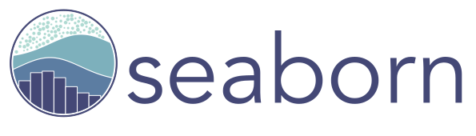

#  Greetings! I'm Boris! 👋 :computer:

&nbsp;
&nbsp;
&nbsp;
  

  
## **About Me**

I'm a **PM** turned **Data Scientist** with a passion for **Deep Learning**. I love diving into data, automating away boredom with Python, and working with Tensorflow. When I'm not coding, you can find me running, hiking and flying in my friends' C172.
 

## **Tech & Tools** 🔧

### Languages

 

### Machine Learning

 

<!--
**8ORI5/8ORI5** is a ✨ _special_ ✨ repository because its `README.md` (this file) appears on your GitHub profile.

Here are some ideas to get you started:

- 🔭 I’m currently working on ...
- 🌱 I’m currently learning ...
- 👯 I’m looking to collaborate on ...
- 🤔 I’m looking for help with ...
- 💬 Ask me about ...
- 📫 How to reach me: ...
- 😄 Pronouns: ...
- ⚡ Fun fact: ...
-->
